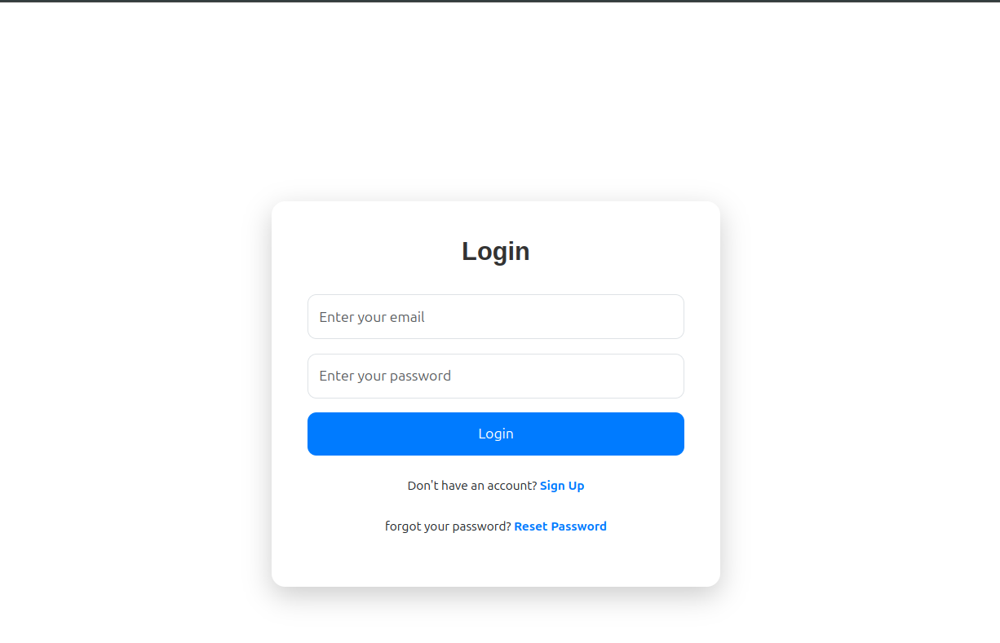
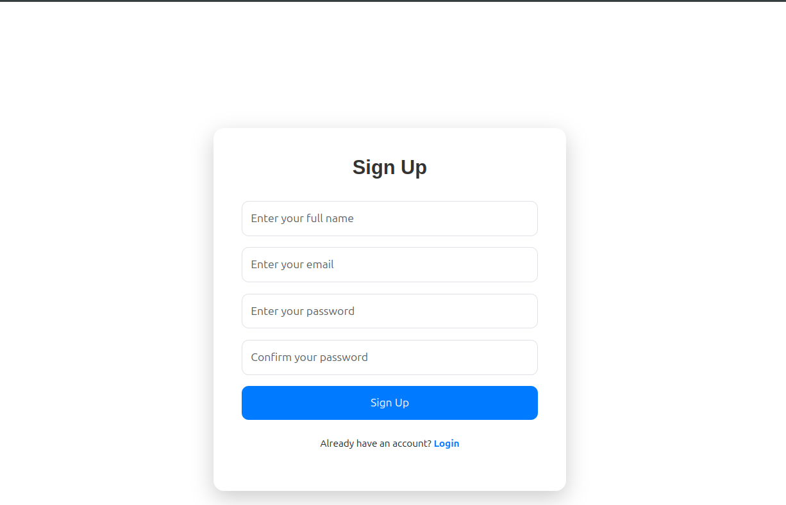
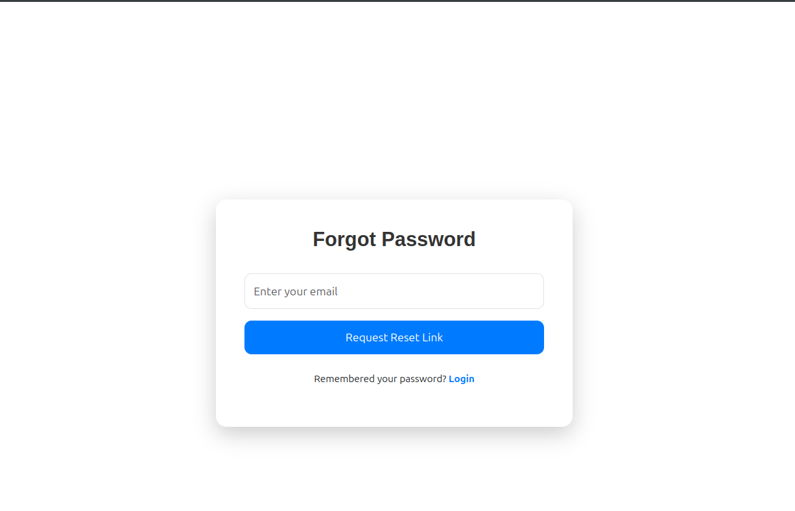
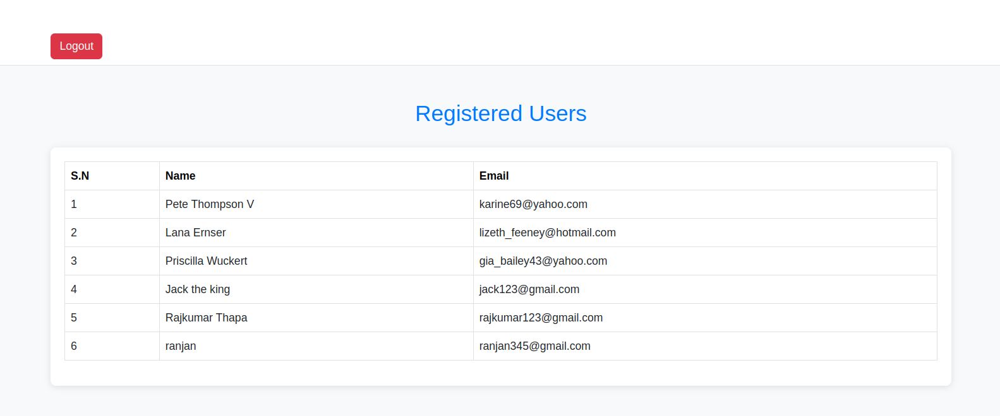

# User Authentication and Management System

## Overview
This project is a User Authentication and Management System built using Node.js, Express, MongoDB, and JWT (JSON Web Tokens). The system allows users to register, login, reset passwords, and can view all registered users. It also features secure routes that require a valid JWT token to access.

## Features

- **User Registration**: Allows users to register with their personal details like email, fullname and password.
- **User Login**: Authenticated users receive a JWT token that can be used to access protected routes like view all the register user.
- **Password Reset**: Users can reset their password using a link sent to their email.
- **JWT Authentication**: Protects sensitive routes, ensuring only authenticated users can access them.

## Screenshots

*Login Page*

*User Login Page*

*Password Reset Page*

*Main Page*

